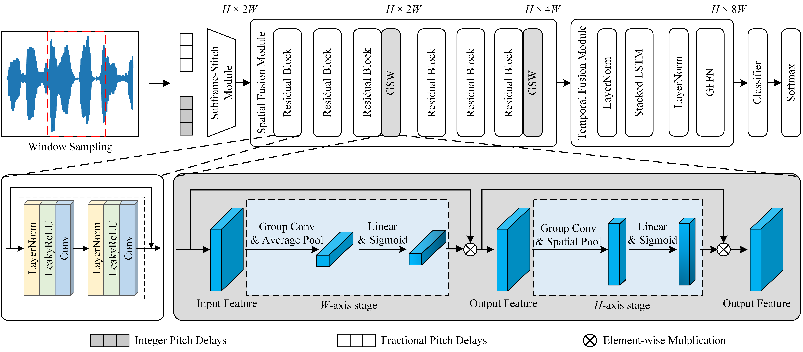

# STFF-SM: Steganalysis Model Based on Spatial and Temporal Feature Fusion for Speech Streams

To promote the development of speech steganalysis, we release the code for our previous TASLP 2022 paper:

[STFF-SM: Steganalysis Model Based on Spatial and Temporal Feature Fusion for Speech Streams](https://ieeexplore.ieee.org/document/9961950)

Hui Tian<sup>1,*</sup>, Yiqin Qiu<sup>2</sup>, Wojciech Mazurczyk<sup>3</sup>, Haizhou Li<sup>4</sup>, Zhenxing Qian<sup>5</sup>



> **Abstract:** The real-time detection of speech steganography in Voice-over-Internet-Protocol (VoIP) scenarios remains an open problem, as it requires steganalysis methods to perform for low-intensity embeddings and short-sample inputs, as well as provide rapid detection results. To address these challenges, this paper presents a novel steganalysis model based on spatial and temporal feature fusion (STFF-SM). Differing from the existing methods, we take both the integer and fractional pitch delays as input, and design subframe-stitch module to organically integrate subframe-wise integer delays and frame-wise fractional pitch delays. Further, we design a spatial fusion module based on pre-activation residual convolution to extract the pitch spatial features and gradually increase their dimensions to discover finer steganographic distortions to enhance the detection effect, where a Group-Squeeze-Weighting block is introduced to alleviate the information loss in the process of increasing the feature dimension. In addition, we design a temporal fusion module to extract pitch temporal features using the stacked LSTM, where a Gated Feed-Forward Network is introduced to learn the interaction between different feature maps while suppressing the features that are not useful for detection. We evaluated the performance of STFF-SM through comprehensive experiments and comparisons with the state-of-the-art solutions. The experimental results demonstrate that STFF-SM can well meet the needs of real-time detection of speech steganography in VoIP streams, and outperforms the existing methods in detection performance, especially with low embedding strengths and short window sizes.

- [STFF-SM: Steganalysis Model Based on Spatial and Temporal Feature Fusion for Speech Streams](#stff-sm-steganalysis-model-based-on-spatial-and-temporal-feature-fusion-for-speech-streams)
  - [🏁 How to Start](#-how-to-start)
    - [⚙️ Installation Dependencies:](#️-installation-dependencies)
    - [📩 Prepare Dataset:](#-prepare-dataset)
    - [📥 Save Model Weights:](#-save-model-weights)
    - [💻 Starting train or inference](#-starting-train-or-inference)
  - [📚 License](#-license)
  - [😊 Citation](#-citation)


## 🏁 How to Start

### ⚙️ Installation Dependencies:

1. Installing anaconda and python (our version == 3.8.10).

2. Creating the new environment and install the requirements.

   ```
   conda create -n STFF_SM python=3.8
   
   conda activate STFF_SM
   
   pip install -r requirements.txt
   ```

------

### 📩 Prepare Dataset:

Due to the limited space of the cloud storage, we give up uploading our own datasets here. To train the model, you should extract integer and fractional pitch delays of your own speech samples to .txt files. Each row of .txt flies should consist of integer and fractional pitch delays of each frame of the speech sample.

Preparing them and place them into `dataset/`.

```
${SepSteNetwithDPES}
|-- dataset              <-- the prepared dataset
	|-- Huang
	|-- Yan
	|-- Liu
|-- model_weights
|-- model.py
|-- train.py
|-- module.py
|-- other python codes, LICENSE, and README files
```

Three steganograohy methods involved in our paper are as follows:

- Y. Huang, C. Liu, S. Tang, and S. Bai, “Steganography integration into a low-bit rate speech codec,” IEEE Trans. Inf. Forensics Secur., vol. 7, no. 6, pp. 1865–1875, Dec. 2012.
- S. Yan, G. Tang, and Y. Sun, “Steganography for low bit-rate speech based on pitch period prediction,” Appl. Res. Comput., vol. 32, no. 6, pp. 1774–1777, 2015.
- X. Liu, H. Tian, Y. Huang, and J. Lu, “A novel steganographic method for algebraic-code-excited-linear-prediction speech streams based onfrac tional pitch delay search,” Multimedia Tools Appl., vol. 78, no. 7, pp. 8447–8461, 2019.

------

### 📥 Save Model Weights:

Saving the weights of trained models and place them into `model_weights/`.

```
${STFF_SM}
|-- dataset
	|-- Huang
	|-- Yan
	|-- Liu
|-- model_weights        <-- the downloaded weights of trained models
|-- model.py
|-- train.py
|-- module.py
|-- other python codes, LICENSE, and README files
```

------

### 💻 Starting train or inference

For example, if you want to inference on samples of 1.0s embedded by Huang’s method at the 10% embedding rate:

```
python ./train.py --length 1.0 --em_rate 10 --method Huang --train Flase -- test True
```

Or if you want to train the model, please set `–train` to `True`.

## 📚 License

This project is released under the MIT license. See [LICENSE](https://github.com/BarryxxZ/STFF-SM/blob/main/LICENSE) for details.

## 😊 Citation

If you find the code and dataset useful in your research, please consider citing our paper:

```
@article{qiu2022stff_sm,
  title={STFF-SM: Steganalysis Model Based on Spatial and Temporal Feature Fusion for Speech Streams},
  author={Tian, Hui and Qiu, Yiqin and Mazurczyk, Wojciech and Li, Haizhou and Qian, Zhenxing},
  journal={IEEE/ACM Transactions on Audio, Speech, and Language Processing},
  volume={31},
  pages={277-289},
  year={2022},
  doi={10.1109/TASLP.2022.3224295}
}
```
